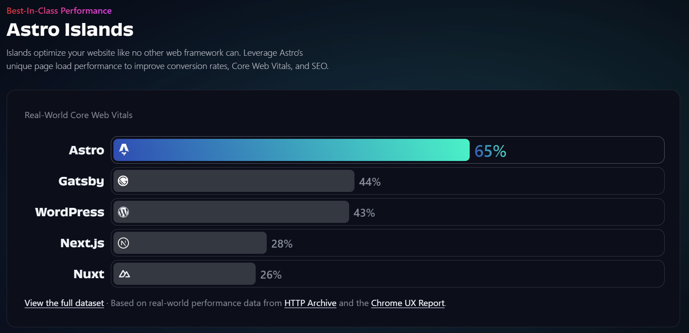
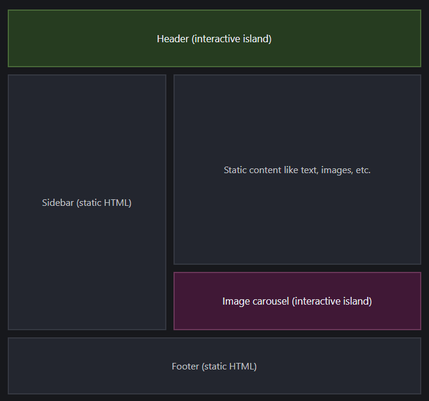

# 🌟 Astro Framework Crash Course 🚀


## 📌 Agenda

1. A Brief History of Astro
2. What is Astro?
3. Islands Architecture in Astro
4. Let's Start Building with Astro!

## 📜 A Brief History of Astro

- Founder: Fred K. Schott
- Year of Creation: 2021
- __Purpose:__ Astro is an open-source web framework designed to build fast, performant, and content-driven websites.
- Astro Technology Company: Established in 2022 to further develop Astro, expand its open-source community, and work towards its v1.0 release.

Astro quickly gained popularity due to its innovative Island Architecture, allowing developers to deliver static HTML by default while keeping dynamic components interactive when needed. Since its release, Astro has been widely adopted for static sites, blogs, e-commerce platforms, and documentation websites. The framework is open-source and actively maintained by the Astro core team and contributors worldwide.

## 🛸 What is Astro?

Astro is a JavaScript web framework optimized for building fast, content-driven websites.

### 🔥 Core Principles of Astro

1. __Server-First Rendering__ – Astro improves website performance by rendering components on the server, sending lightweight HTML to the browser with zero unnecessary JavaScript overhead.
2. __Content-Driven Architecture__ – Astro is designed to work with various content sources, including file systems, external APIs, and CMS platforms.
3. __Customizable & Flexible__ – Extend Astro with your favorite JavaScript UI components, CSS libraries, themes, and integrations.

### 🚀 Best-In-Class Performance

Astro’s Islands Architecture optimizes page load performance, improving Core Web Vitals, SEO, and conversion rates. Compared to other frameworks, Astro has higher Core Web Vitals passing rates:



### 🏗️ Maximum Flexibility

- __Zero Lock-in__ – Astro supports all major UI frameworks, allowing developers to use existing components efficiently:
    - React ⚛️
    - Vue 🔵
    - Preact 💙
    - Svelte 🔥
    - Solid 💎
- __Optimized Client Builds__ – Astro ensures minimal JavaScript is sent to the browser, leading to better performance.

### 🛠 Everything You Need

- __Content Collections__ – Organize Markdown and MDX with built-in TypeScript type-safety and frontmatter validation.
- __Zero JavaScript By Default__ – Ships only the necessary JavaScript and strips away the rest for a faster website.
- __View Transitions__ – Seamlessly morph, fade, and swipe across pages with built-in browser-native View Transition APIs.
- __Middleware Support__ – Add custom logic like authentication, logging, and data fetching for incoming requests.
- __Actions__ – Write type-safe backend functions callable from frontend JavaScript.
- __Environment Variables__ – Manage your configuration efficiently with built-in support.
- __Deployment Adapters__ – Easily integrate with platforms like Vercel, AWS, and more.
- __UI Integrations__ – Use your favorite UI frameworks within Astro’s flexible island architecture.
- __Dev Toolbar__ – Enhance your development workflow with built-in tools and integrations.

### 🌊 Islands Architecture in Astro

Astro introduces the concept of Islands Architecture, which is a hybrid rendering model that allows pages to be mostly static while enabling interactive components only where needed.

#### 🌟 What is Islands Architecture?

- In traditional JavaScript frameworks like React or Vue, the entire page is often hydrated with JavaScript, even if only a small portion needs interactivity.
- Islands Architecture solves this by sending static HTML by default and then hydrating only selected components ("islands") with JavaScript.
- This improves performance, SEO, and user experience by reducing unnecessary JavaScript execution.



#### 🏖️ How Does Islands Architecture Work in Astro?

- __Static by Default__ – Pages in Astro are rendered as static HTML at build time, unless specified otherwise.
- __Partial Hydration__ – Components that need interactivity are selectively hydrated only when necessary.
- __Multiple Rendering Strategies__ – Astro allows defining how and when components should load:
    - `client:load` – Hydrate component immediately on page load.
    - `client:visible` – Hydrate when the component appears in the viewport.
    - `client:idle` – Hydrate when the browser is idle.
    - `client:media` – Hydrate only if a specific media query condition is met.
    - `client:only` – Hydrate only in the browser, skipping server-side rendering.

#### 🌐 Example of Islands in Astro
```
---
import Counter from "../components/Counter.astro";
---

<html>
  <head>
    <title>Astro Islands Example</title>
  </head>
  <body>
    <h1>Welcome to Astro Islands</h1>
    
    <!-- Static content remains unchanged -->
    <p>This is a static paragraph.</p>

    <!-- Interactive component (hydrated on visibility) -->
    <Counter client:visible />
  </body>
</html>
```

In this example:
    - The <p> tag remains static.
    - The <Counter> component is hydrated only when visible.

#### 🌟 Why Use Islands Architecture?

- Improved Performance: Ships minimal JavaScript, reducing load times.
- Better SEO: Static pages are easier to index by search engines.
- More Control: Developers choose which components are interactive.
- Efficient Hydration: Only required parts of the page are interactive, improving resource management.

Astro’s Islands Architecture is a game-changer for modern web development, blending the best of static and dynamic content for a seamless user experience.

## 🎉 Let's Start Building with Astro! 🌟

### 📚 Useful Links:
- [Installation & Setup](https://docs.astro.build/en/install-and-setup/)
- [Project Structure](https://docs.astro.build/en/basics/project-structure/)
- [Editor Setup](https://docs.astro.build/en/editor-setup/)
- [VS Code Extension](https://marketplace.visualstudio.com/items?itemName=astro-build.astro-vscode)
